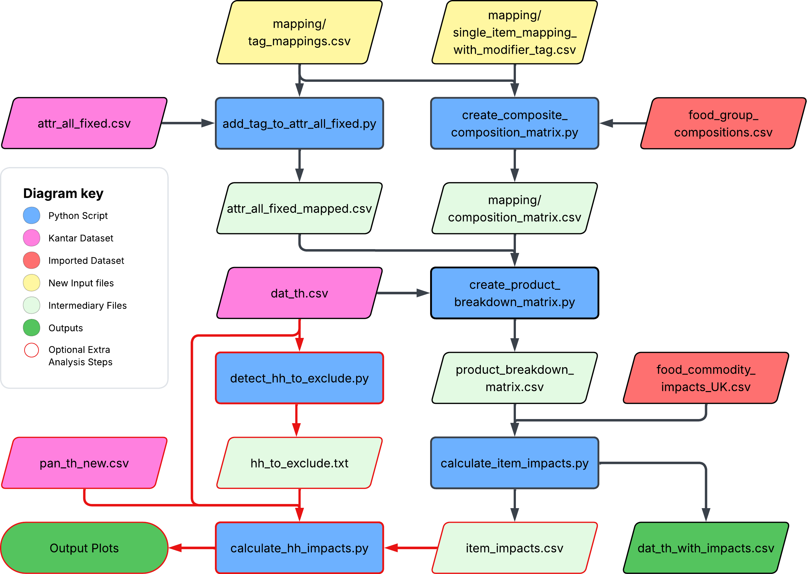

# kantar_add_impacts
## Overview

## Data Files
#### Required:
- data/attr_all_fixed.csv (product data)
- data/dat_th.csv (purchase data)

#### Included:
- data/food_group_compositions.csv (breakdown for composite items)
- data/food_commodity_impacts_UK.csv (bio impacts of each food type)
- data/mapping/tag_mapping.csv (maps RST markets to tags)
- data/mappings/single_item_mapping_with_modifier_tag.csv (maps Mikes categories to Toms)

## Run order:
1. run add_tag_to_attr_all_fixed.py
  
    This adds the mapping tag to each product 

2. run create_composite_composition_matrix.py

    This creates the composition matrix for each different tag, including items that are composed of 100% one food type

3. run create_product_breakdown_matrix.py

    This creates the product breakdown matrix which has the weights in kg of each constituent food type of each item

4. run calculate_item_impacts.py

    Calculates biological impacts of each product

### Other
detect_hh_to_exclude.py - creates a list of hh that submitted less than 50 weeks of data (used in calculate_hh_impacts.py)

run calculate_hh_impacts.py - Calculates  impacts of each hh and plots
